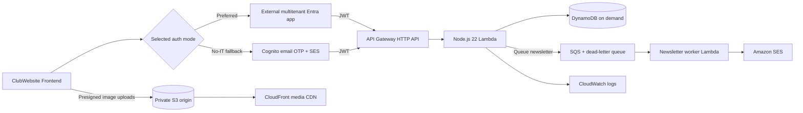

# ClubWebsite Backend

AWS-native backend for the CodeHawks / UNG App Development Club website. This is a clean serverless replacement for the unfinished Linux/PostgreSQL backend: the old project informed the domain, but its authentication and implementation details were not copied.

The repository is ready for local verification and the protected AWS bootstrap/plan/apply process. It has **not** been deployed; the intended AWS account/region, SES domain, frontend origins, and final authentication choice must still be confirmed.

## Authentication without depending on UNG IT

Authentication is selected at deployment time with `auth_provider`:

| Mode | UNG IT dependency | What it proves |
|---|---|---|
| `entra` (preferred) | No UNG-owned app registration, but UNG must allow its users to consent to our externally owned multitenant app. If UNG shows “Need admin approval,” only UNG can change that policy. | Microsoft authenticated the user in the exact UNG tenant and issued an API token for our app. |
| `cognito` (fallback) | None. The user receives a one-time code at their exact `@ung.edu` mailbox. | The user controls that school email inbox; it does not claim UNG approved the application. |

Both modes require an exact `@ung.edu` address and intentionally allow students, faculty, staff, and alumni who retain access. The backend uses its own UUID for every member, so projects, teams, roles, and events are not keyed to Microsoft or Cognito IDs. Choose one mode before onboarding real users; switching an existing population requires an explicit identity-linking migration.

See [authentication strategy](docs/authentication.md) and [Entra consent probe](docs/entra-setup.md).

## Architecture



Cost-conscious defaults:

- API Gateway HTTP API and small ARM64 Lambdas; no always-on server
- one DynamoDB table in on-demand/pay-per-request mode
- private S3 media origin with a small CloudFront distribution
- AWS-owned encryption keys, avoiding a dedicated KMS-key monthly charge
- 14-day logs, modest throttles, and an optional monthly AWS Budget alert
- point-in-time recovery and deletion protection enabled by default

## Implemented functionality

- provider-neutral just-in-time member accounts with no stored passwords
- profiles with display name, avatar, bio, major/minors, optional tech stack, GitHub, and LinkedIn
- constrained presigned avatar, project, and team image uploads for JPEG, PNG, and WebP files up to 5 MiB
- roles: Member, Reservation Designee, Treasurer, Vice President, and President
- role and account-status management, with DynamoDB as the authorization authority
- member directory with public-safe profile output
- members can create projects and teams and request to join them
- in-app notification inbox for project/team join requests, withdrawals, approvals, and rejections
- project/team owners and authorized officers can list requests, accept/reject them, invite members, directly add members, revoke invitations, remove members, and transfer ownership
- invitees can accept/decline; members can withdraw requests or leave
- transactional capacity enforcement and a membership audit history
- event draft/publish/archive management, member RSVPs, and officer RSVP rosters
- role-gated officer newsletters queued to every active club account through SQS and SES
- public project/team/event listings with cursor pagination
- request validation, structured errors, exact CORS origins, throttling, and logs
- Terraform for DynamoDB, Lambda, HTTP API, selectable auth, SES/SQS email, S3/CloudFront media, IAM, logs, and an optional budget

See [API routes](docs/api.md), [email flows](docs/email.md), [authorization policy](docs/authorization.md), [data model](docs/data-model.md), and [migration notes](docs/migration.md).

## Local verification

Requirements: Node.js 22.13+ or 24+, npm, and Terraform 1.10+.

```bash
npm ci
npm run check
terraform -chdir=infrastructure init -backend=false
terraform -chdir=infrastructure validate
```

`npm run check` runs TypeScript, ESLint, tests, and all production Lambda bundles. There is intentionally no unsigned local-auth bypass; protected-route tests inject the claims API Gateway would provide.

## Deployment handoff

1. Decide between Entra and Cognito using [docs/authentication.md](docs/authentication.md). Probe Entra consent before committing the frontend to Microsoft sign-in.
2. Follow the [infrastructure runbook](infrastructure/README.md) to create or update the manual CloudFormation bootstrap in the confirmed AWS account and region.
3. Configure the main-only GitHub plan environment and owner-approved apply environment from the bootstrap outputs.
4. Run the manual workflow with `operation=plan`, and review the full plan without changing AWS.
5. Rerun with `operation=plan-and-apply`, review the fresh plan, and approve the waiting apply environment only when it is correct. This creates the SES identity and prints its Easy DKIM tokens.
6. Complete the cross-repository DNS handoff and human-owned SES production-access request in [docs/email.md](docs/email.md).
7. Sign in once as the intended first President, then use the one-time bootstrap command in [docs/bootstrap.md](docs/bootstrap.md).
8. Connect the frontend using [docs/frontend-integration.md](docs/frontend-integration.md).

Do not commit AWS keys, state files, plan files, tokens, `terraform.tfvars`, or Entra secrets. GitHub uses short-lived OIDC sessions, and the browser flows use public clients without an application client secret.

## Repository layout

```text
src/
  auth/           provider claim boundaries and role permissions
  domain/         entities and request schemas
  email/          queued newsletter delivery through SQS and SES
  media/          constrained S3 presigned uploads
  repositories/   persistence contract and DynamoDB implementation
  api.ts          routes, authorization, validation, and errors
  handler.ts      production Lambda composition root
infrastructure/   AWS Terraform
scripts/          bundles and one-time officer bootstrap helper
test/             unit and API-boundary tests
docs/             setup, contracts, data model, and migration guidance
```

## Deliberate non-goals in this slice

- No finance ledger yet. `treasury.manage` is reserved, but financial records need a separate requirements and security pass.
- No custom API/media domain until DNS ownership and final hostnames are confirmed.
- No automatic image resizing, EXIF stripping, or content moderation yet; current image uploads enforce size and declared MIME type only.
- No guessed legacy import. Import tooling should be built against a real read-only export and an agreed cutover window.
