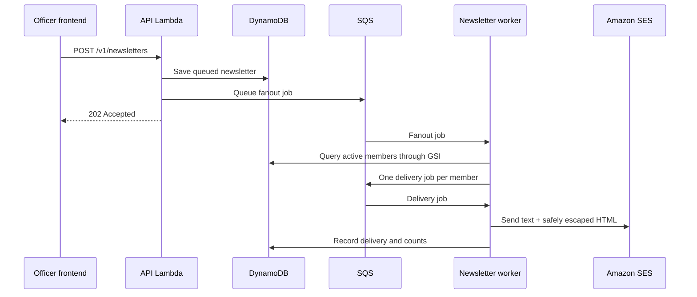

# Account and newsletter email

Amazon SES replaces a third-party sender such as Resend. One verified club-owned sender identity is used for newsletters in either authentication mode and for Cognito account codes when the fallback mode is selected.

## Signup and activation

### Entra mode

1. The user selects **Sign in with Microsoft**.
2. Microsoft authenticates the exact `@ung.edu` identity and issues an API access token.
3. The backend creates the club profile on the first authenticated request.

There is no second CodeHawks verification email because the external identity provider already confirmed the account. The profile is active immediately unless an officer later suspends it.

### Cognito fallback mode

1. The user enters an exact `@ung.edu` email with no password.
2. Cognito creates an unconfirmed account and SES sends the branded CodeHawks activation code.
3. The frontend submits that code with Cognito `ConfirmSignUp`.
4. Cognito confirms the account and marks the email verified; only then can the user sign in.
5. Future sign-ins use an emailed `EMAIL_OTP` code.

The frontend can invoke Cognito `ResendConfirmationCode` when a signup code expires or is lost. The backend never stores these codes.

## Newsletter authorization

The `newsletters.send` permission is granted only to:

- Reservation Designee
- Treasurer
- Vice President
- President

An ordinary Member cannot create, inspect, retry, or send newsletters. Affiliation labels such as student, faculty, staff, or alumni do not grant email permission; only the club role stored in DynamoDB does.

The recipient audience is every club profile whose account status is `active`, including officers. Suspended or deleted/missing profiles are skipped at delivery time.

## Delivery flow

The API never sends a club-wide email during the HTTP request. Queue messages contain newsletter/member UUIDs, not email bodies or recipient addresses. The worker reloads current data, sends one recipient per SES request, and records accepted/skipped outcomes under the newsletter partition. A fixed idempotency UUID prevents accidental duplicate newsletter creation. `sentCount` records requests accepted by SES; later delivery, bounce, or complaint outcomes belong to SES reputation/event telemetry.

SQS and Lambda are at-least-once systems. Delivery records suppress normal redelivery duplicates; a process failure in the narrow interval after SES accepts a message but before DynamoDB records it can still cause a duplicate. Eliminating that final distributed-systems edge would require an email provider API with a durable idempotency token.

## AWS prerequisites

- Verify a club-owned SES domain or From address in the deployment region.
- Publish the SES-provided DKIM DNS records.
- Request SES production access. In the sandbox, sending is restricted and normal `@ung.edu` recipients will not work unless individually verified.
- Set `ses_identity_arn`, `email_from_address`, and optionally `email_reply_to_address` in Terraform.
- Monitor SES reputation metrics and the newsletter dead-letter queue.

The SES configuration set automatically suppresses destinations that bounce or complain. Before production, decide whether routine club newsletters need a user preference/unsubscribe workflow; account-security and login-code messages must remain transactional.

Official references:

- [Cognito user-pool email settings](https://docs.aws.amazon.com/cognito/latest/developerguide/user-pool-email.html)
- [Cognito signup and confirmation](https://docs.aws.amazon.com/cognito/latest/developerguide/signing-up-users-in-your-app.html)
- [SES sending quotas](https://docs.aws.amazon.com/ses/latest/dg/manage-sending-quotas.html)
- [SES suppression lists](https://docs.aws.amazon.com/ses/latest/dg/sending-email-suppression-list.html)
