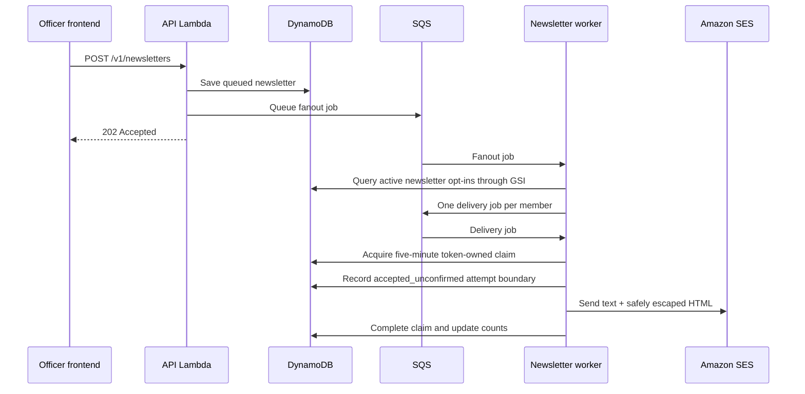

# Account and newsletter email

Amazon SES replaces a third-party sender such as Resend. One verified club-owned sender identity is used for newsletters in either authentication mode and for Cognito account codes when the fallback mode is selected.

## Signup and activation

### Entra mode

1. The user selects **Sign in with Microsoft**.
2. Microsoft authenticates the exact `@ung.edu` identity and issues an API access token.
3. The backend creates the club profile on the first authenticated request.

There is no second CodeHawks verification email because the external identity provider already confirmed the account. The profile is active immediately unless an officer later suspends it.

### Cognito fallback mode

1. The user enters an exact `@ung.edu` email with no password.
2. Cognito creates an unconfirmed account and SES sends the branded CodeHawks activation code.
3. The frontend submits that code with Cognito `ConfirmSignUp`.
4. Cognito confirms the account and marks the email verified; only then can the user sign in.
5. Future sign-ins use an emailed `EMAIL_OTP` code.

The frontend can invoke Cognito `ResendConfirmationCode` when a signup code expires or is lost. The backend never stores these codes.

## Newsletter authorization

The `newsletters.send` permission is granted only to:

- Reservation Designee
- Treasurer
- Vice President
- President

An ordinary Member cannot create, inspect, retry, or send newsletters. Affiliation labels such as student, faculty, staff, or alumni do not grant email permission; only the club role stored in DynamoDB does.

Delivery reconciliation is more sensitive than composing: only the Vice President and President receive `newsletters.reconcile`. They can inspect paginated delivery records and resolve an ambiguous provider attempt. Reservation Designees and Treasurers cannot perform this operation.

The recipient audience is every club profile whose account status is `active` and whose explicit `newsletterOptIn` choice is `true`, including opted-in officers. The choice defaults to `false` for new and legacy profiles. Suspended, opted-out, or deleted/missing profiles are skipped when delivery reloads the current member. Every newsletter footer directs the recipient to turn off Newsletter announcements in profile settings.

## Delivery flow

The API never sends a club-wide email during the HTTP request. Queue messages contain newsletter/member UUIDs, not email bodies or recipient addresses. The worker reloads current data, sends one recipient per SES request, and records accepted/skipped outcomes under the newsletter partition. A fixed idempotency UUID prevents accidental duplicate newsletter creation. A conditional, token-owned delivery lease closes the ordinary check-then-send race between concurrent SQS workers. `sentCount` records requests accepted by SES; later delivery, bounce, or complaint outcomes belong to SES reputation/event telemetry.

SQS and Lambda are at-least-once systems. A new claim is `claimed` for five minutes and carries an unguessable ownership token. This is shorter than the queue's 12-minute visibility timeout (and longer than the worker's two-minute execution timeout), so a crash-before-attempt redelivery arrives after the lease can be reclaimed. A crash or storage error before the external-send boundary can release the claim immediately; if release also fails, a later SQS delivery can replace it after lease expiry. A stale worker cannot begin or complete using an earlier token. If the begin-attempt condition reports an expired or replaced lease, the worker fails that SQS receipt instead of acknowledging it as complete.

Immediately before the SES call, the worker changes the record to `accepted_unconfirmed` and removes the lease. The name is deliberately conservative: a provider send attempt has started, and SES acceptance is unknown until the result is durably completed. A timeout, process crash, or completion-write failure never causes an automatic resend from this state. This avoids routine duplicates but creates a tiny pre-call crash window that also needs human review; exact once-only delivery with automatic recovery would require a provider-side durable idempotency key.

The Vice President or President lists records through `GET /v1/newsletters/{id}/deliveries` and resolves one with `POST /v1/newsletters/{id}/deliveries/{memberId}/reconcile`. `mark_sent` and `mark_skipped` atomically finalize counters and preserve the actor, timestamp, reason, and resolution. `retry` changes the record to durable `retry_pending` and re-enqueues that one member; it requires `acknowledgePossibleDuplicate=true` plus a reason because retry can duplicate a message SES accepted. If enqueueing fails, `retry_pending` remains and the same operator request can safely enqueue it again. Old `sending` delivery records from the pre-lease implementation are treated as ambiguous and can be reconciled, but are never automatically reclaimed.

## SES identity and DNS workflow

SES and public DNS live in separate Terraform states because they have different owners:

- `CodeHawks-Backend/infrastructure` creates the regional SES domain identity and outputs its three Easy DKIM tokens.
- `CodeHawks-FrontEnd/infrastructure` owns the Cloudflare zone and creates one unproxied CNAME per token.

For the first deployment:

1. Create or update the backend bootstrap stack from its reviewed template so the apply role may manage the SES identity.
2. Run the backend workflow with `operation=plan`, review it, then run `operation=plan-and-apply` and approve the exact plan.
3. Copy the backend `ses_dkim_tokens_json` output exactly. It is a JSON array of three non-secret strings.
4. Store that JSON array as `SES_DKIM_TOKENS` in the frontend repository's `infrastructure-production` GitHub environment.
5. Use the frontend **Plan or apply infrastructure** workflow and approve its exact reviewed plan. It creates `<token>._domainkey.codehawks.org` CNAMEs targeting `<token>.dkim.amazonses.com` with Cloudflare proxying disabled.
6. Wait until the SES identity verification and DKIM status are successful in the same AWS region.
7. Have the human owner request SES production access. This account-level approval remains manual; Terraform must not pretend it can grant it.

In the SES sandbox, sending is restricted and normal `@ung.edu` recipients will not work unless individually verified. Configure `ses_domain`, `email_from_address`, and optionally `email_reply_to_address` in backend Terraform, and monitor SES reputation metrics plus the newsletter dead-letter queue after production approval. Production uses the protected `backend-plan-production` variable `EMAIL_REPLY_TO_ADDRESS=contact@codehawks.org`; it is an inbound Cloudflare alias, while SES continues to send only from `noreply@codehawks.org`.

The SES configuration set automatically suppresses destinations that bounce or complain. Routine club newsletters use the profile opt-in/opt-out workflow; account-security and login-code messages remain transactional and are not controlled by that preference.

Official references:

- [Cognito user-pool email settings](https://docs.aws.amazon.com/cognito/latest/developerguide/user-pool-email.html)
- [Cognito signup and confirmation](https://docs.aws.amazon.com/cognito/latest/developerguide/signing-up-users-in-your-app.html)
- [SES sending quotas](https://docs.aws.amazon.com/ses/latest/dg/manage-sending-quotas.html)
- [SES suppression lists](https://docs.aws.amazon.com/ses/latest/dg/sending-email-suppression-list.html)
